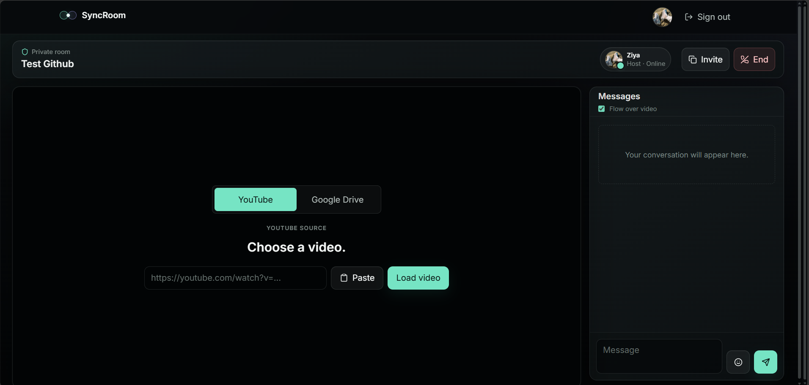
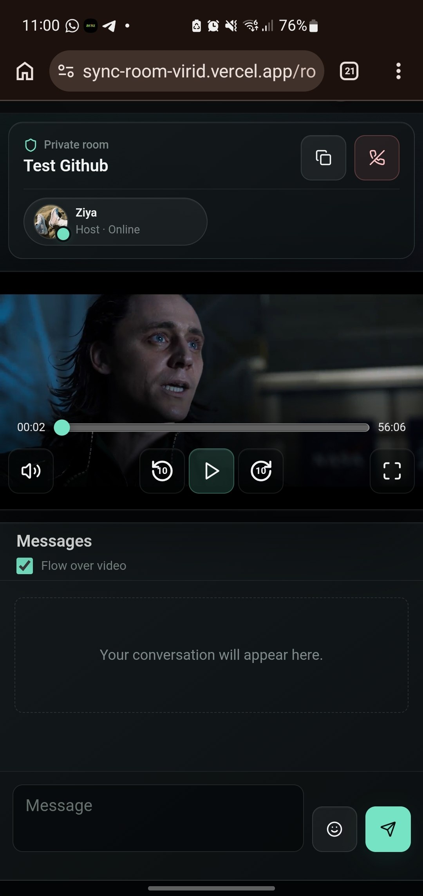
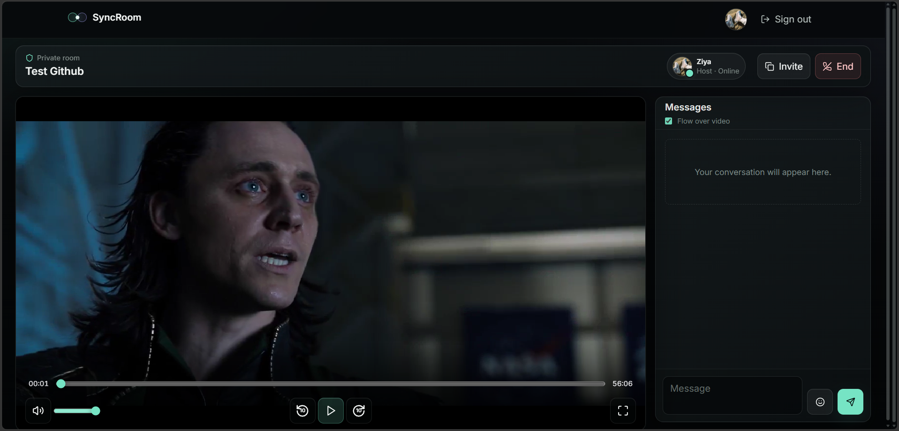
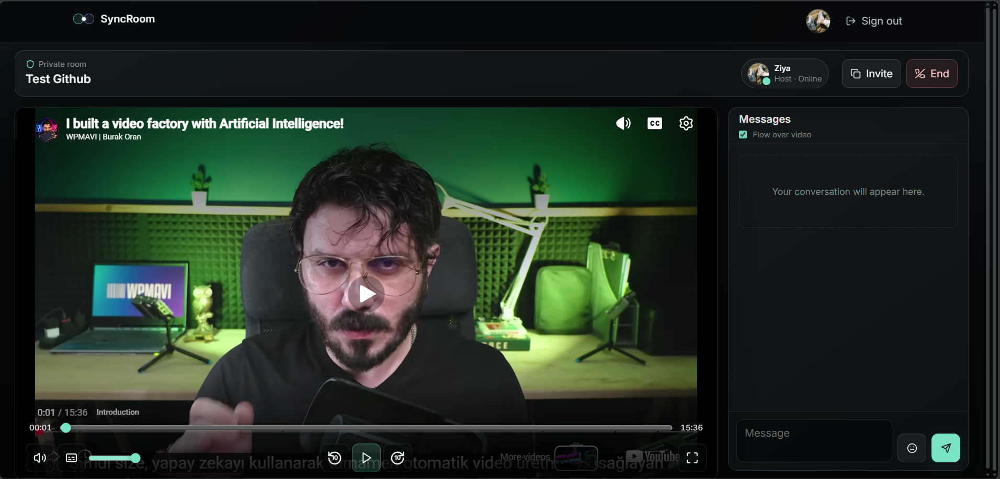
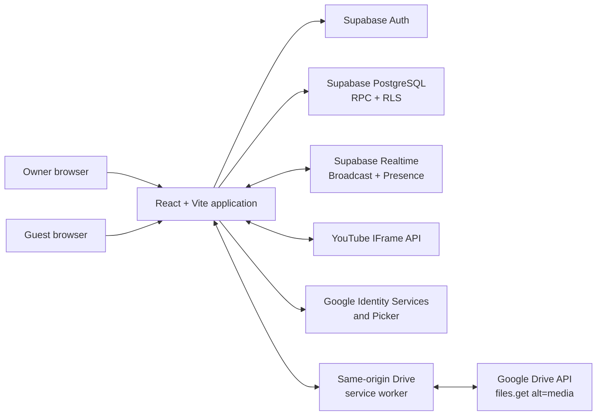
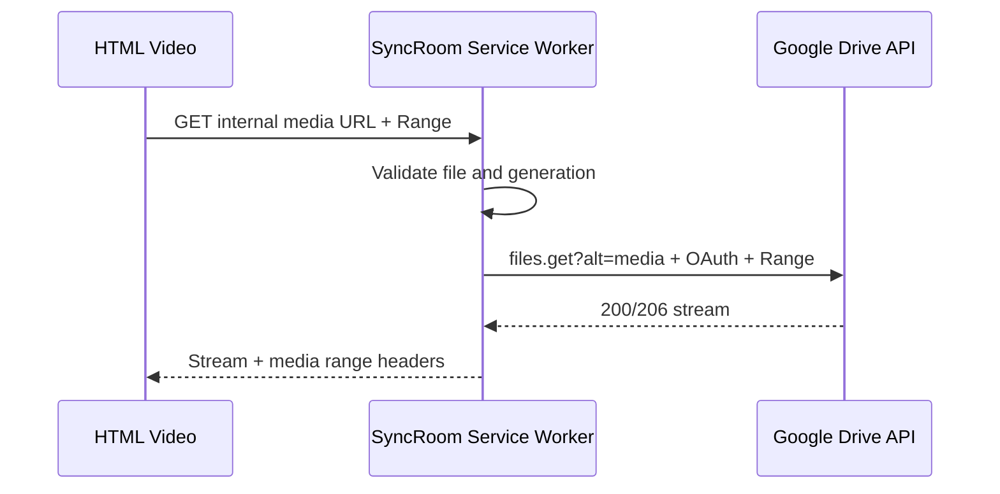

# SyncRoom

> A private two-person synchronized watch-party application for YouTube and private Google Drive videos.

**Just us, perfectly in sync.**

[](https://react.dev/)
[](https://www.typescriptlang.org/)
[](https://supabase.com/)
[](https://sync-room-virid.vercel.app/)


**Production:** [sync-room-virid.vercel.app](https://sync-room-virid.vercel.app/)

**Status:** v1.0 release candidate, production-tested

Access is intentionally restricted. Only the permanent owner and Google accounts explicitly approved by that owner can enter.

## What Is SyncRoom?

SyncRoom is a private watch room for two people. The host selects a YouTube or shared Google Drive video and controls the authoritative playback state; the guest follows in near real time while keeping local control of volume, captions, and fullscreen.

The project combines low-latency Realtime events with durable PostgreSQL recovery state, private channel authorization, responsive chat, and a same-origin service-worker gateway for authenticated Google Drive media streaming. It has no custom application or media backend.

## Highlights

- Private Google OAuth access with one owner and owner-approved guests.
- Exactly two active participants per room, enforced by PostgreSQL RPCs and locking.
- Host-authoritative Play, Pause, seek, playback rate, and 10-second skip controls.
- Supabase private Broadcast and Presence channels protected by Realtime RLS.
- Durable playback recovery after refresh, reconnect, or missed Realtime events.
- Private Google Drive playback without public links or server-side video storage.
- Realtime chat with optimistic delivery, identity hydration, emoji, and flowing video overlays.
- Watch-first layouts for desktop, tablet, mobile portrait, and mobile landscape.

## Screenshots

The production deployment is private, so signing in requires an owner-approved Google account. The third-party media shown below demonstrates SyncRoom's player integrations; SyncRoom does not own that content.

### Watch together

<p align="center">
  
</p>

<p align="center"><em>Viewport-aware desktop watch room with synchronized playback and realtime chat.</em></p>

### Mobile experience

<p align="center">
  
</p>

<p align="center"><em>Watch-first mobile layout with touch controls and inline chat.</em></p>

### Private Google Drive playback

<p align="center">
  
</p>

<p align="center"><em>Private Google Drive playback streamed through SyncRoom's same-origin service-worker media gateway.</em></p>

### YouTube synchronization

<p align="center">
  
</p>

<p align="center"><em>Host-authoritative YouTube playback with synchronized seek, 10-second controls, and local caption settings.</em></p>

## Core Features

### Authentication And Access

- Google OAuth through Supabase Auth.
- One permanent owner and any number of owner-approved guest emails.
- Owner-managed add, revoke, and restore actions from the dashboard.
- Unknown and revoked accounts denied before private data is opened.
- Invite possession alone never grants application access.

### Rooms And Chat

- Private invite deep links with Vercel SPA fallback support.
- Owner-hosted rooms limited to the owner and one active guest.
- Presence, leave, room ending, and reconnect handling.
- Persistent Realtime chat with optimistic confirmation and duplicate prevention.
- Sender identity repair when membership data arrives after a message.
- Flow-over-video messages for live traffic only; history never replays after refresh.
- Inline mobile chat, emoji insertion, and keyboard-safe composition.

### YouTube

- URL parsing for standard, shortened, embed, mobile, and Shorts URLs.
- YouTube IFrame Player API with no YouTube Data API key.
- Host-authoritative Play, Pause, seek, rate, rewind 10, and forward 10.
- Local captions/settings access, mute, volume, and fullscreen.
- Autoplay-blocked recovery, heartbeat drift correction, and refresh recovery.

### Google Drive

- Incremental Google Identity Services authorization using `drive.file` only.
- Google Picker selection for MP4 and WebM files.
- Exact-file access for each browser; the host shares the source file with the guest.
- OAuth-authenticated byte-range streaming through a same-origin service worker.
- Host-authoritative Play, Pause, seek, rewind 10, and forward 10.
- Guest read-only time and progress display.
- Silent token bootstrap/renewal when Google permits, plus bounded media recovery.

## Architecture



Supabase is the authorization, data, and signaling backend. YouTube media stays with YouTube. Google Drive video bytes travel directly from the Drive API to the browser through the local service worker; they do not pass through SyncRoom infrastructure.

## Playback Synchronization

The host is authoritative. Major actions are persisted and broadcast with a monotonically increasing playback state version:

- source change
- Play and Pause
- explicit seek
- playback-rate change

Supabase Realtime Broadcast carries low-latency commands. `room_playback_states` stores a durable recovery snapshot for initial load, refresh, reconnect, and missed-event recovery. While playing, the host broadcasts a heartbeat about every 4.5 seconds and persists a recovery snapshot about every 14 seconds.

Heartbeats never write to PostgreSQL. Target time is derived from the host timestamp, network elapsed time, and playback rate. Small drift is ignored, moderate drift receives a temporary rate correction where supported, and large drift seeks directly. Remote-command suppression prevents player callbacks from echoing an applied host command.

### Bounded Persistence

Playback persistence was redesigned to separate high-frequency Broadcast heartbeats from bounded PostgreSQL snapshots, preventing write amplification and stale-version contention.

- Only the host owns the snapshot timer.
- Snapshot requests are single-flight and never build an unbounded queue.
- Periodic snapshots preserve the current authoritative version.
- A stale optimistic snapshot becomes a safe no-op that returns current state.
- Repeated failures open a temporary client-side circuit breaker.

## Google Drive Streaming Architecture

An HTML `<video>` element cannot attach an OAuth `Authorization` header. SyncRoom gives the element a same-origin URL instead:

```text
/__syncroom_drive_media__/{fileId}?generation={generation}
```

The service worker validates the currently bound file and generation, adds the in-memory OAuth bearer token, forwards the browser `Range` request to `files.get?alt=media`, and streams the response body back without buffering the full video. It preserves required media headers and synthesizes `Content-Range` from trusted Drive metadata when browser CORS visibility hides it.



Drive tokens remain in browser memory. They are never placed in URLs, local storage, session storage, IndexedDB, Supabase, application logs, or the repository. SyncRoom stores only safe room source metadata and never requires a public Drive link.

### Drive Reliability Engineering

- A generation identifier owns every active media session.
- Worker binding is atomic and acknowledged with `MessageChannel`.
- The video source is attached only after the matching bind acknowledgement.
- Stale effect cleanup cannot clear a newer generation.
- Token replacement rebinds the worker without resetting the video element.
- React StrictMode and controller replacement are handled idempotently.
- Missing-session and transient media failures use one bounded recovery path.

## Security Model

- Approved emails live server-side in `public.allowed_users`, never in frontend environment variables.
- Owner-only RPCs manage guest access; direct client writes to the allowlist are blocked.
- PostgreSQL RLS limits rooms, profiles, memberships, messages, and playback snapshots.
- Room creation is owner-only and room capacity is atomically limited to two.
- Public Supabase Realtime channel access is disabled.
- Private Broadcast and Presence authorization is enforced through `realtime.messages` RLS.
- Authoritative playback publishing additionally requires the authenticated room host.
- Google Drive access uses only `https://www.googleapis.com/auth/drive.file`.
- No Supabase `service_role` key, OAuth client secret, refresh token, or database credential is used by the frontend.
- The public repository and its history passed a release-candidate secret-pattern audit.
- The release-candidate dependency audit reported zero known production vulnerabilities.

This is defense in depth, not a claim of perfect security. Supabase policies and RPC checks remain the final authorization boundary even when the UI hides an unavailable action.

## Private Realtime Topics

| Topic | Purpose | Send authorization |
| --- | --- | --- |
| `room:<uuid>` | Presence | Active room members |
| `room:<uuid>:participant` | Readiness and sync requests | Active room members |
| `room:<uuid>:playback` | Authoritative playback events | Active room host only |

Chat persistence and delivery continue through the `messages` table and room-filtered Postgres Changes. Broadcast heartbeats do not replace chat persistence or database recovery snapshots.

## Owner-Managed Guest Access

The owner may approve multiple Google emails, but every room remains an owner-plus-one-guest experience. Guests cannot create rooms, manage or enumerate the allowlist, promote themselves, publish authoritative playback events, or read unrelated room history. Revocation is soft so historical profiles, memberships, and messages remain intact while protected access is denied.

## Responsive Experience

- Viewport-constrained desktop watch stage with an internally scrolling chat sidebar.
- Stacked, watch-first tablet portrait layout.
- Inline mobile chat below the player rather than a modal chat sheet.
- Touch-sized controls and read-only guest progress.
- Real fullscreen for the player stage with best-effort landscape orientation locking.
- Safe-area, dynamic viewport, reduced-motion, and keyboard-aware styling.

## Technology Stack

| Area | Technologies |
| --- | --- |
| Frontend | React 18, TypeScript, Vite, Tailwind CSS, Motion, React Router, Lucide |
| Data and auth | Supabase Auth, PostgreSQL, RPC functions, Row Level Security |
| Realtime | Supabase Broadcast, Presence, Postgres Changes |
| Media | YouTube IFrame API, Google Identity Services, Google Picker, Drive API, Service Worker, HTML5 Video |
| Validation and tests | Zod, Vitest, Testing Library, ESLint, TypeScript |
| Deployment | Vercel |

## Production QA

The v1.0 release candidate completed:

- 224 automated tests across 52 test files.
- ESLint, TypeScript, and production-build verification.
- `npm audit --omit=dev` with zero reported vulnerabilities.
- Authenticated owner/guest tests for access, Presence, chat, YouTube, and Drive.
- Play, Pause, seek, 10-second skip, fullscreen, reconnect, and silent Drive restore tests.
- Mobile, tablet, desktop, direct-route, private-Realtime, and service-worker checks.

These are unit, component, and architecture tests plus manual production QA; the repository does not claim a full automated browser E2E suite. See [`docs/V1_PRODUCTION_QA.md`](docs/V1_PRODUCTION_QA.md) for the detailed checklist.

## Local Development

Requirements: a recent Node.js/npm version, a Supabase project, and Google Cloud configuration for Google OAuth and Drive.

```bash
npm install
cp .env.example .env.local
npm run dev
```

On Windows, copy `.env.example` to `.env.local` manually or run:

```powershell
Copy-Item .env.example .env.local
```

Validation commands:

```bash
npm run lint
npm run typecheck
npm run test
npm run build
```

## Environment Variables

| Variable | Purpose |
| --- | --- |
| `VITE_APP_NAME` | Display name, normally `SyncRoom` |
| `VITE_SUPABASE_URL` | Public Supabase project URL |
| `VITE_SUPABASE_ANON_KEY` | Public Supabase anonymous key; authorization still depends on RLS |
| `VITE_GOOGLE_CLIENT_ID` | Google browser OAuth client ID |
| `VITE_GOOGLE_PICKER_API_KEY` | Browser API key restricted to Google Picker API |
| `VITE_GOOGLE_APP_ID` | Google Cloud project number used by Picker |

Never place a Google OAuth client secret, Supabase `service_role` key, Drive access token, database password, or refresh token in frontend environment files.

## Supabase Setup

Apply the SQL files in [`supabase/migrations`](supabase/migrations) in filename order. The migrations cover:

1. Foundation schema, access helpers, profiles, rooms, messages, and room RPCs.
2. Realtime publication and YouTube playback state.
3. Google Drive source metadata.
4. Playback snapshot concurrency and write-amplification protection.
5. Owner-managed guest access.
6. Private Realtime Broadcast and Presence authorization.

Seed exactly one owner using a placeholder email, then manage guests through the application:

```sql
insert into public.allowed_users (email, private_role)
values (lower('owner@example.com'), 'owner');
```

Enable Google in Supabase Auth, add the Supabase Google callback to the OAuth client, configure local and production redirect URLs, and keep RLS enabled. The `messages` and `room_members` tables must be included in the `supabase_realtime` publication. Public Realtime channel access is disabled for the production deployment.

## Google OAuth And Drive Setup

Normal sign-in uses Supabase Google OAuth without Drive scopes. Drive access is requested separately through Google Identity Services only when a Drive source must be selected or restored.

The current private deployment uses Google OAuth Testing mode. Each newly approved SyncRoom guest must also be added manually as a Google OAuth Test User. Drive authorization must remain limited to:

```text
https://www.googleapis.com/auth/drive.file
```

The Google Picker browser key is API-restricted to Google Picker API. Application/referrer restriction is currently unset because an earlier referrer-restricted configuration caused Picker rejection. Picker now calls `setOrigin(window.location.origin)`; website-referrer restriction should be retested separately before enforcement.

Detailed instructions: [`docs/GOOGLE_DRIVE_SETUP.md`](docs/GOOGLE_DRIVE_SETUP.md).

## Deployment

SyncRoom is a Vite SPA deployed on Vercel:

- Build command: `npm run build`
- Output directory: `dist`
- Environment variables: the six public frontend variables listed above
- SPA rewrite: all client routes fall back to `/index.html`
- Static worker: `/syncroom-drive-sw.js` remains a real JavaScript asset

Add the production origin to Supabase Auth redirect URLs and Google OAuth authorized JavaScript origins. The deployed application uses low-risk `nosniff`, referrer, permissions, and anti-framing headers. A restrictive CSP is intentionally deferred until every third-party media/auth endpoint can be exercised safely.

## Project Structure

```text
src/
  components/       UI, chat, access, and watch-stage components
  contexts/         Authentication lifecycle
  hooks/            Realtime and media lifecycle coordination
  pages/            Login, dashboard, invite, and room routes
  services/         Supabase, Google Drive, Picker, and playback adapters
  utils/            Pure validation, sync, message, and persistence logic
public/
  syncroom-drive-sw.js
supabase/
  migrations/
docs/
  GOOGLE_DRIVE_SETUP.md
  STEP_3_DRIVE_QA.md
  V1_PRODUCTION_QA.md
```

## Known Limitations

- Rooms intentionally support only the owner and one guest.
- Google OAuth Testing mode requires manual Google Test User management.
- A Drive file must be explicitly shared with the intended guest.
- Drive playback is limited to MP4/WebM and the codecs supported by each browser/device.
- SyncRoom does not transcode video or host Drive video bytes.
- Drive subtitle files are not supported.
- Picker website-referrer restriction still requires a separate production retest.

## Future Possibilities

- Installable PWA behavior.
- A custom production domain.
- Drive subtitle support.
- A broader automated browser E2E suite.
- Google OAuth production publishing if the product audience expands.
- Additional local-only playback preferences.

## Author

**Ziya Asgarli**

[github.com/ZiyaAsgarli](https://github.com/ZiyaAsgarli)
